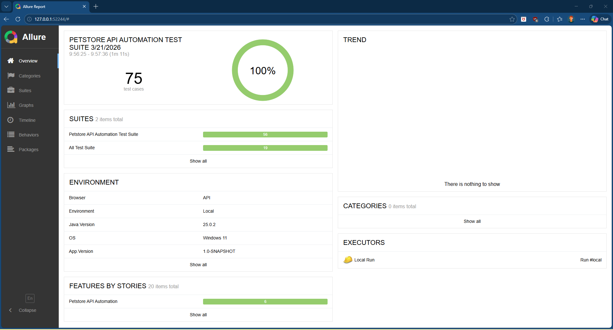

# api-automation-hub

A Maven multi-module API test automation framework built with Java 17, REST Assured, TestNG, and Allure.

## Project Overview

`api-automation-hub` combines two API test projects under one shared engine (`framework-core`) for reusable utilities, centralized dependencies, and consistent reporting.

### Modules

| Module | Description |
|---|---|
| `framework-core` | Shared engine: request builders, config, retry, listeners, logging, validation |
| `restful-booker` | API tests for Restful Booker (CRUD + integration + E2E) |
| `petstore` | API tests for Swagger Petstore (CRUD + E2E) |

## Tech Stack

| Technology | Version |
|---|---|
| Java | 17 |
| Maven | Multi-module |
| REST Assured | 5.5.5 |
| TestNG | 7.11.0 |
| Allure | 2.29.1 adapters + CLI |
| AspectJ Weaver | 1.9.24 |

## Allure Report Showcase

This repository includes full Allure integration:

- Request/response attachments
- Failure stack traces + API snapshots
- Test metadata (`Epic`, `Feature`, `Story`, `Severity`, `Owner`, `TmsLink`)
- Auto-generated `environment.properties`, `categories.json`, and `executor.json`
- History/trend support in CI

Live report (GitHub Pages):

- [Latest Allure Report](https://prasad291024.github.io/api-automation-hub/)

Workflow that publishes the report:

- [.github/workflows/allure-report.yml](.github/workflows/allure-report.yml)

Sample Allure report view:



## Prerequisites

- JDK 17+
- Maven 3.8+
- Node.js (for `npx allure-commandline` fallback)
- Internet access to hit public API endpoints

## How To Run Tests

Run all modules:

```bash
mvn clean test
```

Run specific module:

```bash
mvn -pl restful-booker -am clean test
# or
mvn -pl petstore -am clean test
```

## How To Generate Allure Report (Local)

```bash
mvn clean test
npx --yes allure-commandline generate allure-results --clean -o allure-report
npx --yes allure-commandline open allure-report
```

If GNU Make is available:

```bash
make test-allure
make allure-report
make allure-open
```

## Report History and Trends

To preserve trend graphs between runs, copy previous history before generating a new report:

```bash
mkdir -p allure-results/history
cp -R allure-report/history/. allure-results/history/
```

(Handled automatically in CI workflow.)

## Author

Prasad - SDET | API Automation Engineer  
GitHub: [prasad291024](https://github.com/prasad291024)
